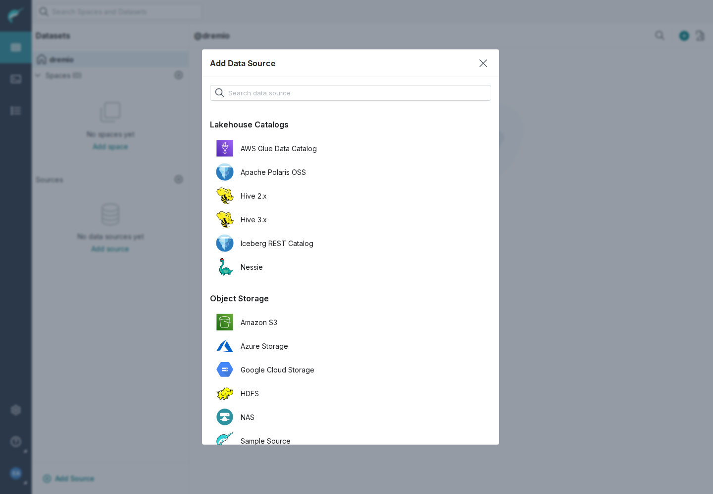

# Polaris RESTCATALOG 설정 가이드

- 대상: Dremio OSS(`feature/polaris-restcatalog` build) → Iceberg REST → Apache Polaris OSS `1.1.0-incubating` → S3 / S3-compatible storage(MinIO).
- 구조와 설계 근거: [design.md](design.md). Storage 상세: [storage.md](storage.md). 보안: [security.md](security.md). 제약: [known-limitations.md](known-limitations.md).
- 이 문서의 모든 secret과 host는 placeholder다: `<client_id>:<client_secret>`, `<access-key>`, `<secret-key>`, `<polaris-host>`, `<minio-host>`, `<catalog>`, `<dremio-host>`, `<user>`, `<password>`. 실제 값을 문서, script, shell history에 남기지 않는다.
- 검증 상태: MinIO 경로는 Phase 4 live와 Phase 5 E2E(UI/REST 등록, lifecycle, read, write, view, cache, 장애)에서 PASS ([test-results.md §5](test-results.md#5-phase-5--실제-e2e--regression)). **실제 AWS S3는 계정이 없어 검증하지 못했다 (`ENVIRONMENT_BLOCKED`)**.

## 0. 필수 값 요약

| 위치 | Key | 값 | 필수 |
|---|---|---|---|
| General | Endpoint URI (`restEndpointUri`) | `http://<polaris-host>:8181/api/catalog` (`/v1` 없이) | 필수 |
| General | Use vended credentials (`isUsingVendedCredentials`) | 기본 해제(false) | 선택 |
| Catalog Properties | `warehouse` | Polaris catalog 이름 (대소문자 정확히 일치) | Polaris 필수 |
| Catalog Properties | `scope` | `PRINCIPAL_ROLE:ALL` 또는 `PRINCIPAL_ROLE:<role>` | Polaris 필수 (Iceberg 기본값 `catalog`는 Polaris가 거부) |
| Catalog Properties | `oauth2-server-uri` | `http://<polaris-host>:8181/api/catalog/v1/oauth/tokens` | 권장 (생략 시 `<uri>/v1/oauth/tokens` + Iceberg deprecation WARN) |
| Catalog Credentials | `credential` | `<client_id>:<client_secret>` | 필수 |
| Catalog Credentials | `fs.s3a.access.key` / `fs.s3a.secret.key` | `<access-key>` / `<secret-key>` | static key 방식이면 필수 |
| Catalog Properties | storage key (`fs.s3a.*`, `dremio.*`) | §3, §4 | storage에 따라 |

규칙:
- **Secret은 반드시 Catalog Credentials(`secretPropertyList`)에** 넣는다. Catalog Properties(`propertyList`)는 masking되지 않는다. UI는 `credential`, `token`, `fs.s3a.secret.key` 같은 key를 Catalog Properties에 넣으면 저장을 막는다. API로 넣으면 저장은 되지만 GET에 값이 그대로 나오고 server.log에 key 이름만 WARN으로 남는다.
- Source state `good`은 **catalog 연결만** 확인한 결과다. Storage 설정(S3 key, endpoint)은 첫 SELECT/INSERT에서 확인된다. 등록 후 `SELECT * FROM <source>.<ns>.<table> LIMIT 1`로 확인한다 (`SELECT count(*)`는 snapshot summary로 답해 S3를 읽지 않을 수 있다).

## 1. Dremio UI 등록 방법

1. Dremio에 관리자 계정으로 로그인한다.
2. 왼쪽 Datasets 화면의 **Sources** 옆 **+ (Add Source)** 를 누른다.
3. **Lakehouse Catalogs** 영역에서 tile을 고른다.
   - **Apache Polaris OSS**: Polaris용 preset. 다음 값이 미리 채워진다: Catalog Properties `warehouse=`(빈 값), `scope=PRINCIPAL_ROLE:ALL`, Catalog Credentials `credential=`(빈 값), Use vended credentials 해제. 저장되는 source type은 `RESTCATALOG`다.
   - **Iceberg REST Catalog**: 빈 form. Polaris 외 REST catalog에도 쓴다.
4. **General** tab
   - **Name**: source 이름 (예: `polaris`). SQL 경로의 첫 level이 된다.
   - **Endpoint URI**: `http://<polaris-host>:8181/api/catalog`. `/v1` suffix를 붙이지 않는다.
   - **Use vended credentials**: static S3 key를 쓰면 해제한다 (기본, 공식 Polaris OSS recipe). Polaris가 table별 임시 credential을 발급하게 하려면 체크한다 (§5).
   - **Allowed Namespaces**: 비워 두면 모든 namespace가 보인다. 일부만 보려면 **Add namespace**로 `sales`, `sales.eu`처럼 추가한다 (§7).
   - **Allowed Namespaces include their whole subtrees**: 체크(기본)하면 entry의 하위 namespace 전체, 해제하면 entry 바로 아래의 table/view만 보인다.
5. **Advanced Options** tab
   - **Enable asynchronous access for Parquet datasets**: 기본 체크. 해제하면 아래 Cache Options도 비활성화된다.
   - **Catalog Properties** (**Add property**): `warehouse=<catalog>`(preset이면 값만 채운다), `scope`, 권장 `oauth2-server-uri`, storage 설정(§3 AWS, §4 MinIO), 선택 `rest.client.connection-timeout-ms=10000`, `rest.client.socket-timeout-ms=60000`.
   - **Catalog Credentials** (**Add credential**, 값 masking): `credential=<client_id>:<client_secret>`, static key 방식이면 `fs.s3a.access.key=<access-key>`, `fs.s3a.secret.key=<secret-key>`.
   - **Cache Options**: Enable local caching when possible(기본 체크), Max percent of total available cache space to use when possible(1–100, 기본 100). 둘 다 metadata에 영향이 없다 (`@NotMetadataImpacting`: 바꿔도 names를 지우고 다시 읽지 않는다). 그래도 값을 바꿔 저장하면 plugin은 다시 시작된다 (§2.5).
   - property row는 이름과 값이 모두 있어야 저장된다. preset의 빈 `warehouse`/`credential`을 채우지 않으면 "Value is required."로 막힌다.
6. **Metadata** tab (Dremio 공통): dataset discovery와 refresh 주기. Polaris에서 source 생성 **뒤에** 만든 namespace는 다음 names refresh(최소 1분, 기본 1시간) 때 tree에 나타난다. 그 table을 SQL로 직접 조회하면 바로 등록된다.
7. **Save**. 성공하면 source가 생성되고 namespace가 folder로 보인다. 실패하면 오류 dialog에 원인 hint가 나온다 (예: "Could not connect to polaris. The Iceberg REST catalog rejected the credentials (OAuth2 error 'unauthorized_client'). Check the 'credential' catalog credential …"). §9 troubleshooting 참고.
8. 수정: source의 **Edit Source**(설정 아이콘). 저장된 secret은 masking되어 보이며 그대로 두면 기존 값이 유지된다.

참고:
- 위 절차는 Phase 5에서 브라우저(Playwright)로 실행했다: Polaris preset과 generic tile 생성, 필수값/secret key validation, Edit의 masked credential, 변경 없는 Save 후 credential 유지 ([test-results.md §5.8](test-results.md#58-ui-agent-g-instance6), 화면: [img/](img/)). `img/`의 Advanced Options 화면 3장(`ui-polaris-preset-advanced.png`, `ui-edit-source-masked-credentials.png`, `ui-validation-secret-in-properties.png`)은 Phase 5 help text 수정(known-limitations U-09) 전에 찍은 것이다. 그 화면의 Catalog Properties 안내(`(no scheme)`, `fs.s3a.requester.pays.enabled=false`, `dremio.bucket.discovery.enabled=false`, `dremio.s3.region=<region>`)는 따르지 않는다. 현재 안내는 `restcatalog-layout.json`과 §4가 기준이다 (non-default region이면 `fs.s3a.endpoint.region=<region>`).
- 배포용 tarball에 이 UI(preset, label, validator)가 들어가려면 `dac/ui`를 다시 build해야 한다 (`-Ddremio.no-ui`로 만든 tarball은 이전 UI jar를 쓴다, known-limitations U-02).



## 2. REST API 등록 방법

### 2.1 인증

```bash
DREMIO=http://<dremio-host>:9047
# 비밀번호는 stdin/file로 넘기고 command line과 history에 남기지 않는다
TOKEN=$(jq -n --arg u '<user>' --arg p "$DREMIO_PASSWORD" '{userName:$u, password:$p}' |
  curl -s -X POST "$DREMIO/apiv2/login" -H 'Content-Type: application/json' -d @- | jq -r .token)
AUTH="Authorization: _dremio$TOKEN"
```

### 2.2 Source type 확인

```bash
curl -s -H "$AUTH" "$DREMIO/api/v3/source/type" | jq '.data[] | select(.sourceType=="RESTCATALOG")'
# {"sourceType":"RESTCATALOG","label":"Iceberg REST Catalog", ...}
curl -s -H "$AUTH" "$DREMIO/api/v3/source/type/RESTCATALOG" | jq .uiConfig.form.tabs[].name
```

26.x에서 source type API는 `/api/v3`에만 있다 (`/apiv2/source/type/RESTCATALOG`는 404).

### 2.3 생성 (`POST /api/v3/catalog`)

`source.json` (MinIO 예제. AWS S3는 §3):

```json
{
  "entityType": "source",
  "type": "RESTCATALOG",
  "name": "polaris",
  "config": {
    "restEndpointUri": "http://<polaris-host>:8181/api/catalog",
    "isUsingVendedCredentials": false,
    "propertyList": [
      {"name": "warehouse", "value": "<catalog>"},
      {"name": "scope", "value": "PRINCIPAL_ROLE:ALL"},
      {"name": "oauth2-server-uri", "value": "http://<polaris-host>:8181/api/catalog/v1/oauth/tokens"},
      {"name": "fs.s3a.aws.credentials.provider", "value": "org.apache.hadoop.fs.s3a.SimpleAWSCredentialsProvider"},
      {"name": "fs.s3a.endpoint", "value": "<minio-host>:9000"},
      {"name": "fs.s3a.connection.ssl.enabled", "value": "false"},
      {"name": "fs.s3a.path.style.access", "value": "true"},
      {"name": "dremio.s3.compat", "value": "true"}
    ],
    "secretPropertyList": [
      {"name": "credential", "value": "<client_id>:<client_secret>"},
      {"name": "fs.s3a.access.key", "value": "<access-key>"},
      {"name": "fs.s3a.secret.key", "value": "<secret-key>"}
    ],
    "enableAsync": true,
    "isCachingEnabled": true,
    "maxCacheSpacePct": 100
  },
  "metadataPolicy": {
    "authTTLMs": 86400000,
    "namesRefreshMs": 3600000,
    "datasetRefreshAfterMs": 3600000,
    "datasetExpireAfterMs": 10800000,
    "datasetUpdateMode": "PREFETCH_QUERIED",
    "deleteUnavailableDatasets": true,
    "autoPromoteDatasets": false
  }
}
```

```bash
curl -s -X POST "$DREMIO/api/v3/catalog" -H "$AUTH" -H 'Content-Type: application/json' \
  -d @source.json | jq '{id, tag, state: .state.status}'
```

- 성공: HTTP 200, `state.status`가 `good`(또는 principal에 root namespace 목록 권한이 없으면 `warn`).
- 실패: HTTP 400, `errorMessage`에 원인 hint와 redact된 server detail이 나온다. `restEndpointUri`가 없으면 `config.restEndpointUri` validation error.
- `metadataPolicy`는 생략하면 server 기본값(names refresh 1시간)이다. `namesRefreshMs`의 최소값은 60000이다.
- `secretPropertyList`가 담긴 `source.json`은 mode 600으로 만들고 사용 후 지운다.

### 2.4 조회 (`GET`, secret masking)

```bash
curl -s -H "$AUTH" "$DREMIO/api/v3/catalog/by-path/polaris" | jq '{id, tag, state, children: [.children[].path]}'
curl -s -H "$AUTH" "$DREMIO/api/v3/catalog/<id>" | jq .config.secretPropertyList
# [{"name":"credential","value":"$DREMIO_EXISTING_VALUE$"}, {"name":"fs.s3a.access.key","value":"$DREMIO_EXISTING_VALUE$"}, ...]
```

`/api/v3/catalog/{id}`, `/api/v3/catalog/by-path/{name}`, `/api/v3/source/{id}`, `/apiv2/source/{name}` 모두 secret 값을 `$DREMIO_EXISTING_VALUE$`로 돌려준다 (Phase 5 A-2, 재시작 후도 같음).

State가 `bad`인 source는 `/api/v3/catalog/{id}`, by-path, `/apiv2/source/{name}`이 400을 돌려준다. 설정을 고치려면 `GET /api/v3/source/{id}`로 읽고 값을 바꿔 `PUT /api/v3/source/{id}`로 보낸다 (known-limitations K-13).

### 2.5 수정 (`PUT /api/v3/catalog/{id}`)

GET 응답의 `id`와 최신 `tag`를 넣는다. 바꾸지 않을 secret은 `$DREMIO_EXISTING_VALUE$`를 그대로 보낸다 (기존 값 유지). 아래는 harness `source.sh update`와 같은 형태(`entityType`, `id`, `tag`, `type`, `name`, `config`)의 body다.

```bash
curl -s -H "$AUTH" "$DREMIO/api/v3/catalog/<id>" > current.json   # secret은 masked 값
jq '{entityType: "source", id, tag, type, name, config, metadataPolicy}
    | .config.isUsingVendedCredentials = true' current.json |
  curl -s -X PUT "$DREMIO/api/v3/catalog/<id>" -H "$AUTH" -H 'Content-Type: application/json' -d @- |
  jq '{tag, state: .state.status}'
```

- Secret의 key 이름을 바꿀 때는 masked 값이 아니라 새 값을 넣는다.
- 잘못된 설정으로 update하면 HTTP 400과 hint가 나오고 기존 source는 이전 설정으로 계속 동작한다. 단, update 실패 후 그 source의 background state/metadata refresh가 멈추는 kernel 동작이 있다 ([known-limitations.md](known-limitations.md) K-01). 같은 설정으로 다시 update해도 복구되지 않고, 설정이 바뀌는 update는 일회성 names refresh만 한다. **Dremio 재시작으로 복구된다.** 그동안 table 직접 query와 `ALTER TABLE … REFRESH METADATA`는 동작한다.
- 잘못된 S3 key로 update해도 state는 `good`이다 (state check는 catalog만 본다). 첫 SELECT/INSERT에서 S3 오류가 나온다.
- Source 이름은 바꿀 수 없다 (`name` 변경 PUT은 404 "Source name is immutable."). 새 이름으로 만든 뒤 기존 source를 지운다.
- `plugins.restcatalog.*` Dremio option은 plugin이 다시 시작될 때 읽는다. `config`의 field가 하나라도 바뀐 update는 plugin을 다시 시작한다. `@NotMetadataImpacting` field(`isCachingEnabled`, `maxCacheSpacePct`, `isUsingVendedCredentials`)만 바꾼 update도 마찬가지다. `@NotMetadataImpacting`은 update 뒤 names를 지우고 전체 refresh할지만 정한다. `metadataPolicy`만 바꾼 update와 같은 설정으로 다시 보낸 update는 plugin을 다시 시작하지 않는다 (`ManagedStoragePlugin.replacePlugin`). 그 밖에는 Dremio 재시작 뒤 적용된다. `maxCacheSpacePct`의 C3 cache 한도는 JVM당 한 번 등록되어 Dremio 재시작 뒤 적용된다 (known-limitations N-14, S-14).

### 2.6 삭제 (`DELETE /api/v3/catalog/{id}`)

```bash
curl -s -o /dev/null -w '%{http_code}\n' -X DELETE -H "$AUTH" "$DREMIO/api/v3/catalog/<id>"   # 204
```

Source 삭제는 Polaris의 namespace/table과 S3 object를 지우지 않는다. State가 `bad`라 `by-path` 조회가 실패하는 source는 `GET /api/v3/catalog`(root listing)에서 id를 찾는다.

참고: `/api/v3/catalog/{id}/refresh`는 source metadata refresh가 아니다 (source에는 404).

### 2.7 Reload / metadata 갱신

Source 전체 refresh를 강제하는 REST endpoint는 없다. Phase 5에서 확인한 방법:

| 목적 | 방법 | 비고 |
|---|---|---|
| Source state 재확인 | `ALTER SOURCE <name> REFRESH STATUS` | state만 갱신 (새 namespace는 반영하지 않음) |
| Table 1개 metadata 갱신 / 외부에서 지운 table 정리 | `ALTER TABLE <source>.<ns>.<t> REFRESH METADATA [FORCE UPDATE]`, `ALTER TABLE … FORGET METADATA` | 외부에서 drop된 table은 "no longer exists, metadata removed." |
| 새 namespace/table 반영 | names refresh (`metadataPolicy.namesRefreshMs`, 최소 60000) | 실측 35–121초 |
| 새 table 즉시 사용 | 그 table을 SQL로 직접 query | 즉시 등록 |
| 외부 snapshot/schema 변경 반영 | 자동 (`dremio.metadata_expiry_check_interval_in_secs`, 기본 60초 + plugin table cache 3초) | 그 사이 schema가 바뀐 table INSERT는 "Table schema … doesn't match" → `REFRESH METADATA` |
| 외부에서 drop된 table 목록 정리 | full dataset refresh (`datasetRefreshAfterMs`, 기본 1시간, `deleteUnavailableDatasets=true`) 또는 위 `REFRESH METADATA` | names refresh는 dataset을 지우지 않는다 |

## 3. Polaris OSS + S3 예제 (AWS S3 공식 baseline)

Dremio 공식 문서의 Polaris OSS recipe와 같은 구성이다. **AWS 계정이 없어 실제 AWS S3에서는 검증하지 못했다 (`ENVIRONMENT_BLOCKED`)**. 같은 key 묶음에 MinIO endpoint 설정만 더한 구성(§4)은 Phase 4 live에서 전체 read/write cycle이 PASS다.

| 위치 | Key | 값 |
|---|---|---|
| General | Endpoint URI | `http://<polaris-host>:8181/api/catalog` |
| General | Use vended credentials | 해제 (`isUsingVendedCredentials=false`) |
| Catalog Properties | `warehouse` | `<catalog>` |
| Catalog Properties | `scope` | `PRINCIPAL_ROLE:ALL` |
| Catalog Properties | `fs.s3a.aws.credentials.provider` | `org.apache.hadoop.fs.s3a.SimpleAWSCredentialsProvider` |
| Catalog Credentials | `credential` | `<client_id>:<client_secret>` |
| Catalog Credentials | `fs.s3a.access.key` | `<access-key>` |
| Catalog Credentials | `fs.s3a.secret.key` | `<secret-key>` |

API JSON:

```json
{
  "entityType": "source",
  "type": "RESTCATALOG",
  "name": "polaris",
  "config": {
    "restEndpointUri": "http://<polaris-host>:8181/api/catalog",
    "isUsingVendedCredentials": false,
    "propertyList": [
      {"name": "warehouse", "value": "<catalog>"},
      {"name": "scope", "value": "PRINCIPAL_ROLE:ALL"},
      {"name": "fs.s3a.aws.credentials.provider", "value": "org.apache.hadoop.fs.s3a.SimpleAWSCredentialsProvider"}
    ],
    "secretPropertyList": [
      {"name": "credential", "value": "<client_id>:<client_secret>"},
      {"name": "fs.s3a.access.key", "value": "<access-key>"},
      {"name": "fs.s3a.secret.key", "value": "<secret-key>"}
    ]
  }
}
```

AWS에서 주의할 점 (code 기준, live 미검증):
- `fs.s3a.endpoint`, `fs.s3a.connection.ssl.enabled`, `fs.s3a.path.style.access`를 넣지 않는다. **`dremio.s3.compat=true`는 AWS에서 쓰지 않는다** (AWS STS 검증을 건너뛴다).
- `fs.s3a.aws.credentials.provider`는 Phase 4부터 생략해도 된다 (Hadoop 기본 chain을 plugin이 `SimpleAWSCredentialsProvider`로 바꾼다). 공식 값대로 넣는 것을 권장한다.
- requester-pays bucket이 아니면 `fs.s3a.requester.pays.enabled=false`를 권장한다 (Dremio 기본값 `true`).
- Dremio의 S3 user에 `s3:ListAllMyBuckets`가 없으면 `dremio.bucket.discovery.enabled=false`를 넣는다.
- Dremio S3 user 권한: `s3:ListBucket`, `s3:GetObject`, `s3:PutObject`, `s3:DeleteObject` (table location 범위).
- Polaris도 자기 storage credential(IAM role 또는 container env)로 `metadata.json`을 쓴다. Polaris catalog의 `storageConfigInfo`(AWS면 `roleArn` 등)는 Polaris 문서에 따라 설정한다 (§6).

## 4. MinIO 사용 예제

Phase 4에서 검증한 최소 recipe ([storage.md §5](storage.md#5-minio-recipe-최소-설정)). HTTP MinIO, IP 또는 hostname endpoint.

Catalog Properties:

```text
warehouse=<catalog>
scope=PRINCIPAL_ROLE:ALL
oauth2-server-uri=http://<polaris-host>:8181/api/catalog/v1/oauth/tokens   # 권장
fs.s3a.aws.credentials.provider=org.apache.hadoop.fs.s3a.SimpleAWSCredentialsProvider
fs.s3a.endpoint=<minio-host>:9000
fs.s3a.connection.ssl.enabled=false        # HTTP MinIO일 때만
fs.s3a.path.style.access=true
dremio.s3.compat=true
fs.s3a.endpoint.region=<minio-region>      # MinIO region이 us-east-1이 아닐 때만 (AWS region id여야 한다)
```

Catalog Credentials:

```text
credential=<client_id>:<client_secret>
fs.s3a.access.key=<access-key>
fs.s3a.secret.key=<secret-key>
```

Key별 필요 여부 (Phase 4 실측):

| Key | 필요 여부 | 없으면 |
|---|---|---|
| `fs.s3a.endpoint` | 필수. `host:port` 권장 (Phase 4부터 `http(s)://host:port`도 동작) | 실제 AWS로 요청 → `InvalidAccessKeyId` |
| `dremio.s3.compat=true` | 필수 | MinIO access key ID로 AWS STS 호출 → "Credentials for the Storage Provider must be valid…" |
| `fs.s3a.connection.ssl.enabled=false` | HTTP MinIO면 필수 (endpoint에 `http://`를 쓰면 불필요) | `SSLException: Unsupported or unrecognized SSL message` |
| `fs.s3a.path.style.access=true` | hostname endpoint면 필수, IP면 자동 | `UnknownHost <bucket>.<host>` hang 또는 `InvalidBucketName` |
| `fs.s3a.endpoint.region` | MinIO region이 `us-east-1`이 아니면 필수 | `AuthorizationHeaderMalformed` / "region is wrong" |
| `dremio.s3.region` | 불필요. 단독으로는 non-default region에서 FAIL (S3A가 읽지 않음) | — |
| `dremio.bucket.discovery.enabled=false`, `fs.s3a.requester.pays.enabled=false` | 불필요 (넣어도 무해) | — |
| `s3.endpoint`, `s3.path-style-access` (Iceberg FileIO key) | 쓰지 않는다 (S3A는 무시하고 AWS로 간다) | — |

TLS MinIO(self-signed CA): JDK `cacerts` 복사본에 CA를 넣은 truststore를 만들고, Dremio coordinator와 모든 executor의 `conf/dremio-env`에 `DREMIO_JAVA_SERVER_EXTRA_OPTS="-Djavax.net.ssl.trustStore=<path> -Djavax.net.ssl.trustStorePassword=<truststore-password> -Djavax.net.ssl.trustStoreType=JKS"`, Polaris에는 같은 truststore와 `JAVA_OPTS_APPEND`를 준다. `fs.s3a.connection.ssl.enabled`는 생략하거나 `true`.

Polaris catalog의 MinIO storage 설정(Management API, §6): `storageType=S3`, `endpoint=http://<minio-host>:9000`(**scheme 필수**), `pathStyleAccess=true`, `region=<minio-region>`, `allowedLocations=["s3://<bucket>/<prefix>/"]`. Polaris process에는 `AWS_ACCESS_KEY_ID`/`AWS_SECRET_ACCESS_KEY`/`AWS_REGION`을 env(secret store)로 준다.

## 5. Vended credentials (선택)

`isUsingVendedCredentials=true`이면 Dremio가 `X-Iceberg-Access-Delegation: vended-credentials` header를 보내고, Polaris가 `loadTable` 응답으로 준 table별 임시 S3 credential(`s3.access-key-id`, `s3.secret-access-key`, `s3.session-token`)로 그 table의 파일에 접근한다. 만료 전에 자동으로 갱신한다.

```text
# General: Use vended credentials = 체크
# Catalog Properties: §4의 storage 연결 설정은 그대로 필요하다 (endpoint, ssl, path-style, compat, region)
# Catalog Credentials: credential=<client_id>:<client_secret>
#   static key(fs.s3a.access.key/secret.key)는 선택 (아래 차이)
```

| 구성 | 동작 (Phase 4, Polaris OSS + MinIO STS, single node) |
|---|---|
| vended + static key 없음 | SELECT/INSERT/CTAS/UPDATE/DELETE/OPTIMIZE PASS. 새 table은 staged create credential(기본 location 전용)로 쓴다. **기본 location 밖 `LOCATION`은 NOT_SUPPORTED** |
| vended + static key | 기존 table은 vended credential. 아직 없는 table은 static key로 쓴다 (기본 location 밖 `LOCATION`도 가능, 그 key에 권한이 있어야 한다) |

- Catalog가 주는 endpoint/region/path-style은 쓰지 않는다. Source의 storage 연결 설정을 쓴다.
- Polaris 쪽: catalog role에 `CATALOG_MANAGE_CONTENT`(또는 그에 해당하는 table data 권한)가 있어야 credential을 받는다. MinIO는 STS `AssumeRole`이 가능해야 한다.
- 각 node(executor 포함)가 Polaris에 직접 접근할 수 있어야 한다.
- Provider는 생략하거나 `SimpleAWSCredentialsProvider`로 둔다. **빈 값으로 명시하지 않는다** (credential을 못 받은 table이 Dremio host identity로 넘어간다).
- Multi-node와 AWS STS vending은 `ENVIRONMENT_BLOCKED`.

## 6. Polaris 쪽 사전 준비 (외부 작업)

Polaris Management API는 이 기능의 범위 밖이다. 아래는 Polaris 관리자가 Dremio source를 만들기 **전에** 해 두어야 하는 일이다 (Polaris 1.1.0 기준, harness `scripts/polaris-e2e/polaris-up.sh`, `polaris-principal.sh`와 같은 순서). 자세한 내용은 Apache Polaris 문서를 따른다.

1. **Catalog 생성** (`POST /api/management/v1/catalogs`): `type=INTERNAL`, `properties.default-base-location=s3://<bucket>/<prefix>`, `storageConfigInfo`(§3 AWS 또는 §4 MinIO), `allowedLocations`.
   - DROP VIEW를 쓰려면 catalog property `polaris.config.drop-with-purge.enabled=true`가 필요하다 (없으면 Dremio DROP VIEW가 permission error + hint).
2. **Principal 생성** (`POST /api/management/v1/principals`): 응답의 client id/secret이 Dremio `credential`(`<client_id>:<client_secret>`)이 된다. secret은 한 번만 표시되므로 secret store에 보관한다.
3. **Principal role** 생성과 principal에 할당 (`POST /principal-roles`, `PUT /principals/<name>/principal-roles`).
4. **Catalog role** 생성과 grant (`POST /catalogs/<catalog>/catalog-roles`, `PUT /catalogs/<catalog>/catalog-roles/<role>/grants`).
   - 읽기/쓰기: `CATALOG_MANAGE_CONTENT`.
   - 읽기 전용 예: `CATALOG_READ_PROPERTIES`, `NAMESPACE_LIST`, `NAMESPACE_READ_PROPERTIES`, `TABLE_LIST`, `TABLE_READ_PROPERTIES`, `TABLE_READ_DATA`, `VIEW_LIST`, `VIEW_READ_PROPERTIES` (Phase 3 live: SELECT 성공, 쓰기는 PERMISSION ERROR).
5. **Catalog role을 principal role에 연결** (`PUT /principal-roles/<principal-role>/catalog-roles/<catalog>`).
6. Dremio의 `scope`는 `PRINCIPAL_ROLE:ALL` 또는 `PRINCIPAL_ROLE:<principal-role>`.

권한 관련 동작:
- Root namespace 목록 권한(`NAMESPACE_LIST` 등)이 없는 principal은 allowedNamespaces 없이 source state가 `warn`이 된다. allowedNamespaces를 주면 `good`.
- 모든 Dremio 사용자가 source에 설정된 principal 하나로 Polaris에 접근한다 (G-27). 사용자별 권한 분리가 필요하면 source를 나누고 Dremio 쪽 권한을 쓴다.

## 7. allowedNamespaces 예제

| 설정 (UI value list / API) | `isRecursiveAllowedNamespaces` | 보이는 것 |
|---|---|---|
| 비움 / 생략 / `[]` | — | 모든 namespace |
| `["sales"]` | true | `sales`와 그 아래 전체 |
| `["sales"]` | false | `sales`의 table/view만 (하위 namespace는 빈 folder) |
| `["sales.eu"]` | true | `sales` → `eu` subtree (조상 `sales`는 folder로만 보인다) |
| `["sales.eu.de", "hr"]` | false | `sales.eu.de`, `hr`의 table/view |
| `["SALES"]` | — | 대소문자를 구분하므로 `sales`와 다르다 |
| `["sales/eu"]` + option `plugins.restcatalog.allowed.ns.separator=/` | true | `sales.eu` subtree (option은 source 시작 시 읽는다, regex) |

API:

```json
"config": { "...": "...", "allowedNamespaces": ["sales.eu", "hr"], "isRecursiveAllowedNamespaces": true }
```

- **접근 제어가 아니다.** 목록 밖 table도 `SELECT * FROM polaris.other.t`처럼 직접 경로로 조회/생성할 수 있다. 권한은 Polaris grant로 제한한다.
- 기본 separator(`.`)로는 이름에 `.`이 든 namespace를 지정할 수 없다. separator는 regex이므로 `|` 같은 문자는 escape한다. entry는 trim하지 않는다.
- 없는 namespace는 무시되고 server.log에 WARN 한 줄이 남는다.

## 8. 추가 설정

| 설정 | 권장 | 이유 |
|---|---|---|
| `rest.client.connection-timeout-ms` / `rest.client.socket-timeout-ms` (Catalog Properties) | `10000` / `60000` | 기본값이 없으면 응답 없는 catalog가 요청을 최대 3분 붙잡고, state가 원인 없는 일반 메시지가 된다 |
| `rest.client.max-retries` | 기본 5 | 429/502/503/504를 재시도한다 (Phase 5: 6회 요청, 약 5.4초). 큰 `Retry-After`를 주는 server면 낮춘다 |
| `fs.s3a.attempts.maximum`, `fs.s3a.retry.limit`, `fs.s3a.connection.establish.timeout` (Catalog Properties) | 운영 요구에 맞게 낮춤 (예: Phase 5 측정 `1`/`1`/`3000`) | 기본값이면 storage가 응답하지 않을 때 SELECT가 수 분 이상 붙잡히고 cancel도 storage 복구 전까지 끝나지 않는다 (K-15). 낮추면 일시적인 storage 오류에도 빨리 실패한다 |
| `token-refresh-enabled` | 기본(true) 유지 | false면 token 만료 직후 query 1건이 실패한다 |
| Metadata names refresh | 운영 요구에 맞게 (최소 1분) | Polaris에서 새로 만든 namespace가 Dremio tree에 보이는 지연 |
| Cache Options (`isCachingEnabled`, `maxCacheSpacePct`) | 기본 유지 | OSS 배포본의 C3 cache는 `enableAsync=true`일 때만 동작한다. `maxCacheSpacePct` 변경은 Dremio 재시작 뒤 적용된다. 사용량은 `sys.cache.*`로 본다 |
| `conf/logback.xml` | 배포본 그대로 | HttpClient/AWS SDK/Netty logger의 INFO 고정 block을 지우거나 DEBUG로 바꾸지 않는다 (token/session token 노출) |
| Secret 암호화 | `dremio-admin encrypt`로 만든 `secret:1.…` 값을 Catalog Credentials에 넣는다 | 기본은 KV store 평문 (G-12). key는 같은 data dir에 있다 |

## 9. Troubleshooting

| 증상 (오류 메시지) | 원인 | 조치 |
|---|---|---|
| 400 "…rejected the credentials (OAuth2 error 'unauthorized_client')…" / `invalid_client` | 잘못된 client id/secret | Catalog Credentials `credential` 확인 |
| 400 `invalid_scope` hint | `scope` 누락 또는 잘못된 principal role | `scope=PRINCIPAL_ROLE:ALL` 또는 존재하는 role |
| 400 "…because the 'warehouse' catalog property is not set… Please specify a warehouse" / "did not accept the warehouse … Unable to find warehouse" | `warehouse` 누락/오타 (대소문자) | Polaris catalog 이름과 정확히 일치 |
| 400 "Unable to reach the Iceberg REST catalog at …" | endpoint/port/network | Endpoint URI (`/api/catalog`, `/v1` 없이) |
| "The TLS connection … failed …" | https/http 불일치, 신뢰하지 않는 인증서 | scheme, `javax.net.ssl.trustStore` |
| state `bad` "Source is not currently available"(원인 없음), hang | Polaris 무응답 + timeout 미설정 | `rest.client.*-timeout-ms` 설정 |
| state `warn` "…denied listing the top-level namespaces (HTTP 403)…" | principal에 root namespace 목록 권한 없음 | grant 추가 또는 allowedNamespaces 지정 |
| "…denied the request to <action> [<entity>] … Check the privileges…" (PERMISSION ERROR) | Polaris grant 부족 | catalog role grant 확인 |
| DROP VIEW permission error + `polaris.config.drop-with-purge.enabled` hint | Polaris catalog 설정 | catalog property를 `true`로 |
| "Folder [..] cannot be deleted because it is not empty…" | 비어 있지 않은 namespace | 안의 table/view/folder 먼저 삭제 |
| 새 namespace가 Dremio에 안 보임 | names refresh 주기 | 기다리거나(최소 1분 + 처리 시간) table을 SQL로 직접 조회 |
| `Forbidden: Invalid locations … not in the list of allowed locations` | `LOCATION`이 namespace location 밖 (Polaris 정책) | namespace location 아래로 |
| `Credentials for the Storage Provider must be valid…` (STS 403) | S3-compatible인데 `dremio.s3.compat` 없음 | `dremio.s3.compat=true` |
| `InvalidAccessKeyId` (MinIO) | `fs.s3a.endpoint` 없음 | `fs.s3a.endpoint=<host>:<port>` |
| `SSLException: Unsupported or unrecognized SSL message` | HTTP endpoint, SSL 기본값 true | `fs.s3a.connection.ssl.enabled=false` |
| `UnknownHostException: <bucket>.<host>`, `InvalidBucketName` | hostname endpoint에 path-style 없음 | `fs.s3a.path.style.access=true` |
| `AuthorizationHeaderMalformed`, "region is wrong" | region 불일치 | `fs.s3a.endpoint.region=<minio-region>` |
| "<name> is not a valid AWS region." | MinIO custom region 이름 | MinIO region을 AWS region id로 (NOT_SUPPORTED) |
| `SignatureDoesNotMatch` / S3 403, state는 `good` | 잘못된 S3 secret (state check는 storage를 보지 않는다) | Catalog Credentials의 S3 key |
| `PERMISSION ERROR: Access denied on …metadata.json`, `SimpleAWSCredentialsProvider: No AWS credentials in the Hadoop configuration` | S3 key도 vended도 없음 (fail closed) | S3 key 추가 또는 vended 사용 |
| `Failed to get subscoped credentials … Sts 403`, CTAS `SYSTEM ERROR: RESTException` | **Polaris** 쪽 storage credential 오류 | Polaris storage 설정/IAM |
| CREATE TABLE 재시도 시 "already exists" | 이전 CREATE가 Polaris에는 남고 Dremio 쪽 S3 오류로 실패 | Polaris에서 table drop 후 재시도 |
| vended source의 explicit `LOCATION` CTAS가 `AmazonS3Exception: Access Denied` | staged create credential은 기본 location만 | `LOCATION` 생략 또는 static key 추가 |
| `IllegalStateException: Invalid AWSCredentialsProvider provided` | Phase 4 이전 build에서 provider 생략 | provider 명시 또는 Phase 4 이후 build |
| update 실패 후 새 namespace/table이 계속 안 보임 | kernel: update 실패 시 background refresh 정지 | Dremio 재시작 (K-01) |
| 외부에서 drop한 table이 목록에 남고 query는 "not found" | names refresh는 dataset을 지우지 않는다 | `ALTER TABLE … REFRESH METADATA` 또는 dataset refresh 대기 (§2.7) |
| 외부에서 schema를 바꾼 직후 INSERT "Table schema … doesn't match with query schema" | metadata 유효성 검사 주기(기본 60초) 안의 stale metadata | `ALTER TABLE … REFRESH METADATA` |
| Storage가 죽었을 때 SELECT가 끝나지 않고 cancel도 안 됨 | S3A 기본 재시도 | §8의 `fs.s3a.*` 재시도/timeout 설정 |
| 429/5xx/timeout 때 query 오류가 "Unable to process …", "Server error …", "Error occurred while processing GET request"뿐 | table lookup 경로는 401/403만 hint로 매핑 (C-08) | source state 메시지와 server.log 확인 |
| Dremio 재시작 뒤 source가 "Source is not currently available."만 표시 | 시작 실패의 원인 hint는 server.log에만 (K-12) | server.log의 "Suggested User Action", 설정은 `/api/v3/source/{id}`로 수정 |
| Polaris principal secret을 회수했는데 source가 계속 동작 | 실행 중 session은 client secret 없이 token을 갱신한다 (X-09) | Polaris grant 회수, source update 또는 Dremio 재시작 |
