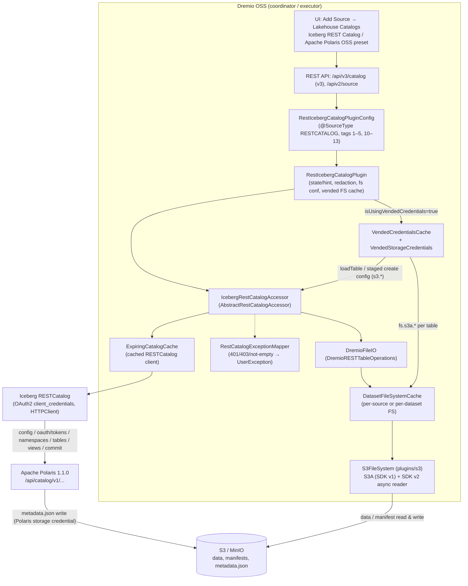

# Polaris RESTCATALOG 설계

- 작업 정의: [polaris-catalog-support.md](../reference_docs/catalog-support/polaris-catalog-support.md)
- 기준: `feature/polaris-restcatalog` (base `799ccbda4 Release 26.0.5`), Phase 1–4 commit (`67cf10e4c`, `f2553db4a`, `ffd1cc1b2`, `3b85d3619`, `691f2b5a9`). Apache Polaris `1.1.0-incubating`, Iceberg `1.7.0-5f7c992-20250730084652-3bf8b99` (Dremio fork).
- 관련 문서: [configuration.md](configuration.md) (등록 방법), [storage.md](storage.md) (Object Storage), [security.md](security.md) (secret/log), [known-limitations.md](known-limitations.md), [test-results.md](test-results.md), [compatibility-matrix.md](compatibility-matrix.md), [progress.md](progress.md).
- 모든 secret은 placeholder다: `<client_id>:<client_secret>`, `<access-key>`, `<secret-key>`.

## 1. 목표와 비목표

### 1.1 목표

- Dremio OSS의 기존 `plugins/icebergcatalog` RESTCATALOG 구현을 완성해, Apache Polaris OSS를 **Lakehouse Catalog**로 쓸 수 있게 한다.
- 구현은 **generic Iceberg REST Catalog**다. Polaris는 "Iceberg REST spec을 구현한 catalog 중 하나"로 다룬다. Polaris 이름은 UI preset, help text, 오류 hint 문구에만 나온다.
- Dremio 공식 26.x Iceberg REST Catalog 설정(필드, property key, JSON 형태)과 맞춘다. 공식 문서의 Polaris OSS recipe(`warehouse`, `scope`, `credential`, `fs.s3a.*`, `isUsingVendedCredentials=false`)가 그대로 동작해야 한다.
- 공통 source framework(metadata refresh, dataset expiration, cache, masking, REST API)가 하는 일은 다시 만들지 않는다.

### 1.2 비목표 (범위 제외)

- **Polaris Management API**: catalog 생성, principal / principal role / catalog role 관리, grant/revoke, Polaris Admin Console. 이것들은 Dremio 밖의 사전 준비 작업이다 ([configuration.md §6](configuration.md#6-polaris-쪽-사전-준비-외부-작업)).
- **Polaris 전용 engine / source type**: 새 `@SourceType`을 만들지 않는다. Polaris는 UI의 client-side preset이며 저장되는 type은 `RESTCATALOG`다.
- **별도 OAuth2 / HTTP client**: Iceberg `RESTCatalog`의 OAuth2(client_credentials, token refresh)와 `HTTPClient`를 그대로 쓴다.
- MinIO 전용 code: S3-compatible storage는 기존 Dremio S3 plugin(`S3FileSystem`)의 설정으로 다룬다.

## 2. 아키텍처

### 2.1 구성도

### 2.2 Control path (catalog)

1. Source 설정(`propertyList` + `secretPropertyList`)을 `RestIcebergCatalogPlugin.getConfigPropertyList`가 합친다. 같은 key가 둘 다 있으면 secret 쪽 값이 이긴다. null 원소, 빈 이름, null 값은 건너뛴다 (G-14 backend).
2. `buildCatalogProperties`가 `catalog-impl=RESTCatalog`, `uri=<restEndpointUri>`와 모든 property를 Iceberg catalog property로 넘긴다. `isUsingVendedCredentials=true`이고 사용자가 같은 header를 넣지 않았으면 `header.X-Iceberg-Access-Delegation=vended-credentials`를 추가한다.
3. `IcebergRestCatalogAccessor`는 `ExpiringCatalogCache`가 가진 `RESTCatalog` 하나를 재사용한다 (`plugins.restcatalog.catalog.expire_seconds`, 기본 1800초 뒤 재생성). `RESTCatalog`가 `/v1/config?warehouse=`와 OAuth2 token 발급/갱신을 처리한다.
4. Source state check(`getState` → `checkStateInternal`)는 cached client로 `listNamespaces(root)`를 1회 호출한다. HTTP 401(stale session)일 때만 새 client로 다시 확인하고, 성공하면 `ExpiringCatalogCache.replace`로 교체하면서 table/view cache를 비운다. 5xx/429/timeout은 cached client를 유지한다 (G-11).
5. Namespace는 Dremio folder, table/view는 dataset이다. allowedNamespaces는 discovery 시작점과 folder listing만 정한다 (§6).

### 2.3 Data path (storage)

1. `applyConfigPropertiesToFsConf`가 REST client 전용 key를 뺀 모든 property를 Hadoop conf로 복사한다. `start()`의 `createCatalog`와 `getFsConfCopy()`마다 실행되므로 catalog에 접근하지 않는 executor도 S3 설정을 갖는다 (G-07).
2. Hadoop 기본 provider chain이 그대로 남아 있으면 `replaceHadoopDefaultCredentialsProvider`가 `SimpleAWSCredentialsProvider`로 바꾼다. Source에서 지정한 provider(빈 값 포함)는 그대로 둔다 (Phase 4, fail closed).
3. `AbstractRestCatalogAccessor`가 table의 FileIO를 `DremioFileIO`로 바꾼다 (`org.apache.iceberg.rest.DremioRESTTableOperations`). Commit은 REST `updateTable`이므로 새 `metadata.json`은 **Polaris가** 쓰고, data file과 manifest는 **Dremio가** 쓴다 ([storage.md §2.2](storage.md#22-읽기쓰기-주체-b의-throwaway-minio-trace-polaris와-dremio에-서로-다른-s3-user)).
4. 파일 접근: `IcebergCatalogPlugin.createFS` → `DatasetFileSystemCache` → `s3://`를 `dremioS3://`로 바꾼 Dremio `S3FileSystem`. 쓰기/list/head는 Hadoop S3A(AWS SDK v1), data file 읽기는 SDK v2 async reader다.

### 2.4 Vended credentials path (`isUsingVendedCredentials=true`, Phase 4)

1. `createFSCache`가 per-dataset `DatasetFileSystemCache(getFsConfForDataset, …, true)`와 node별 `VendedCredentialsCache`를 만든다. flag가 false면 이 경로는 전혀 동작하지 않는다.
2. `VendedCredentialsCache`가 `CatalogAccessor.loadTableStorageProperties(table, stageNewTable)`로 `catalog.loadTable(...).io().properties()`를 읽는다. Table이 아직 없으면(CTAS는 commit 전에 data를 쓴다) 자기 S3 credential이 **없는** source만 staged create로 기본 location용 credential을 받는다 (commit하지 않음).
3. `withoutSourceProperties`가 source 자신의 property(같은 key, 같은 값)를 뺀다 (Iceberg REST client가 catalog property를 FileIO property에 합치기 때문).
4. `VendedStorageCredentials.applyTo`가 `s3.access-key-id` / `s3.secret-access-key` / `s3.session-token`을 `fs.s3a.access.key` / `fs.s3a.secret.key` / `fs.s3a.session.token`으로 옮기고 provider를 `TemporaryAWSCredentialsProvider`(session token이 없으면 Simple)로 정한다. bucket별 credential key를 지우고 `dremio.bucket.discovery.enabled=false`로 둔다. Endpoint/region/path-style/TLS는 source 값을 쓴다.
5. 만료 `min(5분, 남은 수명의 절반)` 전에 갱신한다. "credential 없음"은 5분, 조회 실패는 30초 cache하고 그동안 source의 storage 설정을 쓴다. Credential은 plan/fragment/KV/profile로 가지 않고 각 node가 catalog에 직접 묻는다.
6. 이 node에서 실행한 CREATE TABLE/CTAS/DROP TABLE은 그 table의 credential과 FS를 비운다 (`forgetTableStorage`).

## 3. 주요 class

경로 prefix: `plugins/icebergcatalog/src/main/java/com/dremio/plugins/icebergcatalog/` (아래 `store/`, `dfs/`).

| Class | 경로 | 역할 | 주요 Phase |
|---|---|---|---|
| `RestIcebergCatalogPluginConfig` | `store/RestIcebergCatalogPluginConfig.java` | `@SourceType(value="RESTCATALOG", label="Iceberg REST Catalog", uiConfig="restcatalog-layout.json")`. tag 10–13 필드 | 2 |
| `IcebergCatalogPluginConfig` | `store/IcebergCatalogPluginConfig.java` | 공통 필드 tag 1–5 (property list, async, cache) | 기존 |
| `RestIcebergCatalogPlugin` | `store/RestIcebergCatalogPlugin.java` | property 병합, REST client 전용 key 분리, sensitive key 판정(`isSensitivePropertyKey`), redaction(`redactSecrets`), state와 오류 hint(`getState`, `describeConnectionFailure`, `RECENT_FAILURES`), provider 교체, folder CRUD, vended FS cache | 2–4 |
| `IcebergRestCatalogAccessor` | `store/IcebergRestCatalogAccessor.java` | cached `RESTCatalog`, state check(`checkStateInternal`), 401 시 client 교체, `NamespaceListingForbiddenException` | 3 |
| `AbstractRestCatalogAccessor` | `store/AbstractRestCatalogAccessor.java` | namespace/table/view 동작, allowedNamespaces discovery와 folder listing, 403/401 매핑, `ForbiddenMappingTableOperations`/`CommitForbiddenException`, partitioned CTAS 재 stage(`stagedCreateOperations`), `loadTableStorageProperties`, FileIO 교체 | 기존 + 3, 4, 5 |
| `ExpiringCatalogCache` | `store/ExpiringCatalogCache.java` | catalog client 수명, `getIfPresent`/`replace`/`close` (race 수정) | 3 |
| `RestCatalogExceptionMapper` | `store/RestCatalogExceptionMapper.java` | Iceberg 예외 type + server message만으로 `UserException` 생성 (§5) | 3 |
| `CatalogAccessor` | `store/CatalogAccessor.java` | `loadTableStorageProperties` default method | 4 |
| `VendedCredentialsCache` | `store/VendedCredentialsCache.java` | node별 table credential cache, 갱신/실패/없음 수명, redact된 WARN | 4 |
| `VendedStorageCredentials` | `store/VendedStorageCredentials.java` | vended `s3.*` → `fs.s3a.*`, provider, 만료, 값 없는 `toString()` | 4 |
| `DatasetFileSystemCache` | `dfs/DatasetFileSystemCache.java` | per-dataset FS, entry별 만료 marker, `invalidateDatasets`, 최소 수명 1초 | 4 |
| `DremioRESTTableOperations` | `plugins/icebergcatalog/src/main/java/org/apache/iceberg/rest/DremioRESTTableOperations.java` | REST table operations를 `DremioFileIO`로 감싼다 | 기존 |
| `S3FileSystem` | `plugins/s3/src/main/java/com/dremio/plugins/s3/store/S3FileSystem.java` | `getEndpoint()`: scheme이 있으면 유지 (G-08) | 4 |
| Layout | `plugins/icebergcatalog/src/main/resources/restcatalog-layout.json` | UI form (General / Advanced Options), MinIO help text(`fs.s3a.endpoint.region`) | 2, 4, 5 |
| UI preset | `dac/ui/src/utils/sourceUtils.ts` (`SOURCE_PRESETS`, `addSourcePresetTiles`, `validateSourcePropertyLists`) | "Apache Polaris OSS" tile, propertyList secret 검사 | 2 |
| Log 설정 | `distribution/resources/src/main/resources/conf/logback.xml` | HttpClient 4/5 wire·headers, SigV4 signer, Netty logger INFO 고정 | fix, 4 |
| Options | `sabot/kernel/src/main/java/com/dremio/exec/store/IcebergCatalogPluginOptions.java`, `sabot/kernel/.../exec/catalog/CatalogOptions.java` | §4.2 | 기존 |

## 4. 설정

### 4.1 Config 필드 (protostuff tag)

Tag 1–9는 `IcebergCatalogPluginConfig`, 10–19는 `RestIcebergCatalogPluginConfig`에 예약되어 있다. 6–9는 사용하지 않는다.

| Tag | 필드 | Type / 기본값 | UI label | 비고 |
|---|---|---|---|---|
| 1 | `propertyList` | `List<Property>` / null | Catalog Properties | Iceberg catalog property로 전달. REST client 전용 key를 뺀 나머지는 Hadoop conf에도 복사. 값은 masking되지 않는다 |
| 2 | `secretPropertyList` | `List<Property>` / null, `@Secret` | Catalog Credentials | API GET에서 `$DREMIO_EXISTING_VALUE$`. KV store에는 평문 (G-12) |
| 3 | `enableAsync` | boolean / true | Enable asynchronous access for Parquet datasets | |
| 4 | `isCachingEnabled` | boolean / true, `@NotMetadataImpacting` | Enable local caching when possible | |
| 5 | `maxCacheSpacePct` | int 1..100 / 100, `@NotMetadataImpacting` | Max percent of total available cache space to use when possible | |
| 10 | `restEndpointUri` | String, `@NotBlank` | Endpoint URI | `/v1` 없이. Polaris: `http://<polaris-host>:8181/api/catalog` |
| 11 | `allowedNamespaces` | `List<String>` / null (전체) | Allowed Namespaces | separator option으로 level 구분 |
| 12 | `isRecursiveAllowedNamespaces` | boolean / true | Allowed Namespaces include their whole subtrees | |
| 13 | `isUsingVendedCredentials` | boolean / false, `@NotMetadataImpacting` | Use vended credentials | Phase 2 추가. 25.2.0 bytes 호환 test 있음 |

### 4.2 Dremio option (support key)

| Option | 기본값 | 의미 |
|---|---|---|
| `plugins.restcatalog.enabled` | true | RESTCATALOG source 사용 (`getEnableOption`). Phase 1 정적 분석상 false여도 `GET /api/v3/source/type/RESTCATALOG`와 create는 막지 않는다 (G-20, 미변경) |
| `plugins.restcatalog.mutable.enabled` | true | CREATE/INSERT/DML/DROP 등 쓰기 |
| `plugins.restcatalog.views_supported` | true | view |
| `plugins.restcatalog.folders_supported` | true | CREATE/DROP FOLDER |
| `plugins.restcatalog.allowed.ns.separator` | `\.` (regex) | allowedNamespaces level 구분자. source 시작 시 읽는다 |
| `plugins.restcatalog.table_cache.enabled` / `view_cache.enabled` | true / true | accessor의 table/view cache |
| `plugins.restcatalog.table_cache.size_items` | 10000 | |
| `plugins.restcatalog.table_cache.expire_after_write_seconds` | 3 | |
| `plugins.restcatalog.file_system.expire_after_write_minutes` | 5 | FS cache entry 수명 |
| `plugins.restcatalog.file_system.optimistic_locking` | false | |
| `plugins.restcatalog.catalog.expire_seconds` | 1800 | `ExpiringCatalogCache`의 REST client 재생성 주기 |

### 4.3 REST client 전용 key (Hadoop conf로 복사하지 않음)

`credential`, `token`, `scope`, `oauth2-server-uri`, `audience`, `resource`, `token-exchange-enabled`, `token-refresh-enabled`, `token-expires-in-ms`, `rest.access-key-id`, `rest.secret-access-key`, `rest.session-token`, prefix `header.`, `rest.auth.`, `rest.client.`, `urn:ietf:params:oauth:token-type:` (`RestIcebergCatalogPlugin.REST_CLIENT_ONLY_PROPERTY_KEYS` / `_PREFIXES`). 그 밖의 `rest.*` key는 복사된다.

## 5. 오류 매핑

원칙: 매핑은 **Iceberg 예외 type**(REST client가 HTTP status에서 만든다)과 **server message**만 본다. Catalog 고유 지식(Polaris 설정 이름)은 hint 문구에만 넣는다. 모든 server message는 redact → HTML 제거·공백 정리·300자 제한 → 다시 redact된다.

### 5.1 Source 생성/상태 (`RestIcebergCatalogPlugin.getState`)

| 원인 | 결과 |
|---|---|
| OAuth2 오류 (`invalid_client`, `unauthorized_client`, `invalid_scope`, `invalid_grant`, `unsupported_grant_type`, `invalid_request`) | `bad`, "Could not connect to <name>. <OAuth2 hint> Details: …". API 400 `errorMessage`에 그대로 나온다 (G-09) |
| `warehouse` 누락 / 불일치 | warehouse hint |
| connection refused / unknown host | "Unable to reach the Iceberg REST catalog at <sanitized endpoint>…" |
| timeout (`rest.client.*-timeout-ms` 설정 시) | "did not respond in time … rest.client.*-timeout-ms" |
| TLS (`SSLException`) | scheme / certificate / `javax.net.ssl.trustStore` hint |
| 5xx / 503 | server error / unavailable hint |
| 그 밖의 HTTP (404/409/429/502/504) | 후보 status를 나열한 hint (정확한 code는 Iceberg 예외에 없음) |
| root namespace listing 403 | allowedNamespaces가 없으면 `warn`, 있으면 `good` |

생성 실패 시 Dremio는 시작하지 않은 원래 instance로 되돌린다. 그 instance가 `RECENT_FAILURES`(source 이름+endpoint, 2분, redact된 state만)의 실패를 반환하므로 API 응답에 실제 원인이 나온다.

### 5.2 동작 중 오류 (`RestCatalogExceptionMapper`)

| Iceberg 예외 / 상황 | Dremio 오류 |
|---|---|
| `ForbiddenException` (403) – load/create/drop table·view, folder, CTAS staging, dataset lookup | PERMISSION ERROR "… denied the request to <action> [<entity>] …" + privilege hint |
| 403 + purge 관련 message (DROP VIEW) | PERMISSION ERROR + `polaris.config.drop-with-purge.enabled` hint (G-06) |
| commit 403 | `CommitForbiddenException`(`ForbiddenException` 하위, cause = permission error). Iceberg `CleanableFailure`라 거부된 commit의 manifest가 정리되고, 사용자에게는 PERMISSION ERROR |
| `NotAuthorizedException` (401) | PERMISSION ERROR + credential hint (state check가 client를 교체) |
| `NamespaceNotEmptyException` (409) / 400 "not empty" | accessor는 typed `NamespaceNotEmptyException`, plugin `deleteFolder`가 VALIDATION ERROR "Folder [..] cannot be deleted because it is not empty…" (G-10) |
| 부모 namespace 없음 / 이미 존재 | VALIDATION ERROR |
| `NoSuchNamespaceException` (drop) | "Folder does not exist." |
| `CommitFailedException` (409) | 매핑하지 않음 (기존 concurrent modification 경로) |
| 그 밖 (`ServiceFailureException`, 429 `RESTException`, timeout/connection reset, commit 시 `RESTException` 등) | 매핑하지 않음 → 원래 예외 (known limitation C-06, C-08. Phase 5 F-12–F-14). Source state 메시지(§5.1)에는 이 경우에도 hint가 있다 |

REST v3 `POST /api/v3/catalog` folder 생성의 403은 `CatalogEntityForbiddenException`으로 바꿔 HTTP 403을 돌려준다.

## 6. allowedNamespaces

- `null`/`[]`: 모든 namespace (`[]`는 `null`로 저장). `["."]`는 root namespace.
- entry는 `plugins.restcatalog.allowed.ns.separator`(regex, 기본 `\.`)로 level을 나눈다. trim하지 않고 대소문자를 구분한다. 기본 separator로는 이름에 `.`이 든 namespace를 지정할 수 없다 (G-24).
- recursive(기본): entry의 subtree 전체. non-recursive: entry의 table/view만, 직접 하위 namespace는 빈 folder로 보인다 (B-5).
- folder listing은 nested entry의 조상 folder를 property 없이 넣고 **부모가 먼저** 오도록 정렬한다. Dremio `SourceMetadataManager.handleFolderListing`이 부모보다 먼저 나온 folder를 삭제하기 때문이다 (Phase 3 Integration에서 발견한 bug 수정). 다른 entry에 포함된 entry는 discovery 시작점에서 뺀다.
- 없는/금지된 namespace는 stack trace 없는 WARN 한 줄이다.
- **접근 제어가 아니다** (설계 결정, B-2). 직접 경로로 하는 SELECT/CREATE는 막지 않는다. 권한은 Polaris grant로 제한한다.

## 7. Secret 처리

상세: [security.md](security.md).

- 저장: secret은 `secretPropertyList`(Catalog Credentials)에 둔다. API GET은 `$DREMIO_EXISTING_VALUE$`로 masking하고, masked 값 그대로 PUT하면 기존 값이 유지된다. KV store에는 평문이다 (G-12). 완화책은 `dremio-admin encrypt` 값(`secret:1.…`)을 넣는 것이다.
- 잘못된 위치: `propertyList`에 secret key(`isSensitivePropertyKey`: 정확한 key 9개 + `secret`/`password`/`account.key`/`private.key`/`private-key`/`sas-token` 포함, `.token`/`-token`/`_token` 접미사)를 넣으면 UI는 저장을 막고 backend는 key 이름만 WARN한다 (G-13). UI와 backend는 같은 규칙을 쓴다.
- 메시지: state/오류 메시지는 source config의 secret 값과 그 `:` 분할 부분을 `****`로 바꾼다. 긴 값부터, 4자 미만은 건너뛰고, 8자 미만은 앞뒤가 영숫자가 아닐 때만 바꾼다. Endpoint는 user info/query/fragment를 뺀다.
- Hadoop conf: OAuth2 secret과 REST client key는 복사하지 않는다 (§4.3).
- Vended credential: node memory(`VendedCredentialsCache`)와 table별 FS conf에만 있다. `toString()`은 종류와 만료 시각만 보여 준다.
- Log: `conf/logback.xml`이 `org.apache.hc.client5.http.wire`/`headers`, `org.apache.http.wire`/`headers`, `com.amazonaws.auth.AWS4Signer`, `software.amazon.awssdk.auth.signer`, `software.amazon.awssdk.http.auth.aws.internal.signer`, `io.netty.handler.logging.LoggingHandler`, `io.netty.handler.codec.http2.Http2FrameLogger`를 INFO로 고정한다.
- S3 credential이 없으면 fail closed: Dremio host의 `AWS_*` env나 instance profile로 넘어가지 않는다. Host identity는 provider를 빈 값으로 명시할 때만 쓴다 (opt-in).

## 8. UI

- Add Source 화면의 **Lakehouse Catalogs** 영역에 두 tile이 있다.
  - **Iceberg REST Catalog** (`RESTCATALOG`, label은 공식 명칭과 같게 변경, G-18).
  - **Apache Polaris OSS** (client-side preset, G-15). 저장 type은 `RESTCATALOG`다. `propertyList`에 `warehouse=""`, `scope=PRINCIPAL_ROLE:ALL`, `secretPropertyList`에 `credential=""`, `isUsingVendedCredentials=false`를 미리 채운다. 빈 값 row는 validator("Value is required.")가 저장을 막으므로 사용자가 반드시 채운다.
- Layout (`restcatalog-layout.json`):
  - **General**: Endpoint URI(required), Use vended credentials, Allowed Namespaces(value list, "All namespaces are visible"), Allowed Namespaces include their whole subtrees.
  - **Advanced Options**: Enable asynchronous access, Catalog Properties, Catalog Credentials(`secure`), Cache Options(`isCachingEnabled`, `maxCacheSpacePct`, `enableAsync` checkbox가 제어).
  - `metadataRefresh`: `datasetDiscovery=true`, `authorization=false`. Metadata 등 나머지 tab은 UI가 공통으로 붙인다.
- Validator(`validateSourcePropertyLists`): property row에 이름과 값이 필요하고, `propertyList`의 secret key를 막는다. Edit에서는 저장된 source에 이미 있던 key는 막지 않고 새로 추가하거나 이름을 바꾼 row만 막는다.

## 9. 설계 결정과 근거

| # | 결정 | 근거 |
|---|---|---|
| D-1 | Polaris 전용 source type 대신 `RESTCATALOG` + UI preset | 공식 Dremio 문서가 Polaris를 RESTCATALOG recipe로 설명한다. backend type이 하나면 API/upgrade/test 표면이 작다 (Phase 1 Option A) |
| D-2 | `isUsingVendedCredentials` 기본값 false (공식 UI 기본값 true와 다름) | 기존 RESTCATALOG source의 동작을 바꾸지 않기 위해서다. Polaris OSS recipe도 false다. `@NotMetadataImpacting`이라 toggle만으로 metadata가 재수집되지 않는다 |
| D-3 | Iceberg `RESTCatalog`의 OAuth2/HTTP client를 그대로 사용 | token refresh, retry, endpoint discovery를 다시 만들지 않는다. 별도 client는 secret 처리 표면을 늘린다 |
| D-4 | 오류 매핑은 예외 type + message 기반 generic 구현 | Polaris 외 REST catalog에도 같은 의미로 동작한다. Polaris 이름은 hint 문구에만 |
| D-5 | state check는 cached client 재사용, 401에서만 교체 | 매번 새 client(token + config)를 만들던 G-11 해결. 일시적 5xx에 사용 중인 client를 닫지 않는다 |
| D-6 | commit 403을 `UserException`이 아니라 `CommitForbiddenException`(`ForbiddenException`)으로 | Iceberg `CleanableFailure` 계약을 지켜 거부된 commit의 manifest를 정리한다. 사용자 메시지는 같은 PERMISSION ERROR |
| D-7 | `rest.client.*-timeout-ms` 기본값을 주입하지 않음 | generic RESTCATALOG의 기존 동작을 바꾸기 때문. 권장값만 문서화 ([security.md §5](security.md#5-재시도와-timeout-iceberg-rest-client)) |
| D-8 | allowedNamespaces는 discovery 범위만 (접근 제어 아님) | 기존 동작 유지. 강제하면 query path 전체에 검사가 필요하다. 권한은 catalog grant의 책임 |
| D-9 | Hadoop 기본 provider chain만 `SimpleAWSCredentialsProvider`로 교체 | provider 생략 시 SDK v2가 chain을 거부하던 문제 해결 + key 없는 source가 host identity로 조용히 넘어가지 않게(fail closed). 명시 값은 존중 |
| D-10 | Vended credential은 S3 credential만 옮기고 endpoint/region은 source 값 | S3-compatible storage에서 catalog가 주는 endpoint를 신뢰하지 않고 운영자가 정한 연결 설정을 유지한다. ADLS/GCS는 범위 밖 |
| D-11 | Static key가 있는 source는 새 table에 staged create credential을 쓰지 않음 | staged create credential은 기본 location만 덮는다. static key로 쓰면 Phase 4 이전처럼 기본 location 밖 `LOCATION`도 동작한다 |
| D-12 | `DROP TABLE`은 purge=false | 기존 plugin 동작 유지. data 삭제는 catalog/운영자 정책 |
| D-13 | Polaris Management API 미구현 | 범위 제외. catalog/principal/grant는 외부 사전 준비 |
| D-14 | S3 endpoint scheme 처리는 `plugins/s3`에서 1줄 수정 | 공통 S3 plugin의 버그(`http://http://…`)이며 MinIO 전용 code를 만들지 않는다. 기존 `host:port` 설정의 결과는 같다 |
| D-15 | Partitioned CTAS는 commit할 metadata의 spec/sort order/location/property로 staged create를 다시 만들어 commit한다 (`stagedCreateOperations`) | CTAS의 schema-only staged create 위에 새 table metadata를 commit하면 partition spec에 `SetDefaultPartitionSpec`이 없어 Polaris가 unpartitioned spec 0을 default로 둔다 (Phase 5 C-6). Iceberg REST의 표준 create 경로만 쓰므로 Polaris 전용 code가 아니다. Unpartitioned CTAS와 다른 commit은 기존 경로 그대로 |

## 10. 변경 이력

| Phase | Commit | 내용 |
|---|---|---|
| 1 | `67cf10e4c` | 구조 분석과 Gap G-01..G-28 ([phase1-analysis.md](phase1-analysis.md)), compatibility matrix, progress. 코드 변경 없음 |
| 2 | `f2553db4a` | `@SourceType("RESTCATALOG")`, `isUsingVendedCredentials`(tag 13), `restEndpointUri` `@NotBlank`, `restcatalog-layout.json`, Polaris UI preset, property 병합/REST key 분리(G-07, G-12 일부), sensitive key 검사(G-13), registration/layout/round-trip test, UI fix(G-19) |
| fix | `ffd1cc1b2` | Local CI archive 범위, atomic stream close, `conf/logback.xml`에 HttpClient 5 wire/headers INFO 고정 |
| 3 | `3b85d3619` | OAuth2/연결 오류 hint의 API 노출(G-09), state check client 재사용(G-11), `RestCatalogExceptionMapper`(G-06, G-10, G-22 매핑), `ExpiringCatalogCache` race 수정, allowedNamespaces folder listing 수정, E2E harness `scripts/polaris-e2e`, [phase3-oauth-catalog.md](phase3-oauth-catalog.md), [security.md](security.md) |
| 4 | `691f2b5a9` | Vended credential runtime(G-04), provider fail closed, `S3FileSystem` endpoint scheme(G-08), HttpClient 4/SigV4/Netty logger 고정, harness env 정리, Local CI `s3-test`, [storage.md](storage.md) |
| 5 | TBD (Lead) | 실제 E2E / Regression ([test-results.md §5](test-results.md#5-phase-5--실제-e2e--regression)): partitioned CTAS 수정(D-15), layout MinIO help text, harness `sql.sh` 결과 조회 수정, flaky TLS test 수정. 7개 instance live PASS 139 / FAIL 8 (kernel K-01 3, known C-08 3, known K-15 1, minor 1) / NOT_SUPPORTED 5 |
| 6 | TBD | 문서 세트(design, configuration, known-limitations, test-results), release readiness |
